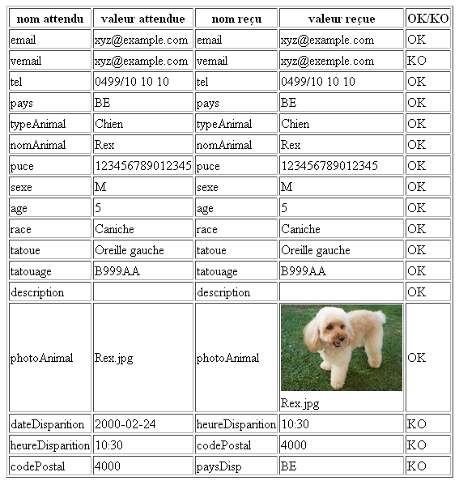

# Les formulaires
Créer le document ../form.html avec le formulaire suivant :

---

##Consignes impératives
- le nom du formulaire est "form1"
- il utilise la méthode "post" avec type d'encodage **multipart/form-data** afin d'uploader une image vers le serveur.
- le script qui reçoit les données se trouve à l'URL (sur serveur interne) **http://10.59.26.130/~user22/form/form.php**
- le texte « * pour les champs obligatoires » est dans un paragraphe identifié "symbole"
- chaque ligne est dans un **div** de la classe **row**
- chaque label est lié à son champ via attribut for
- le premier champ obtient automatiquement le focus
- les noms des champs sont dans l'ordre : *email*, *vemail*, *tel*, *pays*; *typeAnimal*, *nomAnimal*, *puce*, *sexe*, *age*, *race*, *tatoue*, *tatouage*, *description*, *photoAnimal*; *dateDisparition*, *heureDisparition*, *codePostal* et *paysDisp*
- veillez à bien respecter le caractère obligatoire des champs marqués d'une *
- veillez à bien respecter tous les *placeholders*
- veillez à utiliser pour chaque champ un attribut title adéquat (info-bulle explicite qui renseigne l'Internaute sur l'information à entrer)
- les adresse e-mail sont limitée à 60 caractères maximum et ont une taille apparente de 40 caractères
- le numéro de téléphone est limité à 20 caractères maximum et possède une taille apparente de 20 caractères
- les options pour le pays (des coordonnées) sont *Belgique*, *France* et *Luxembourg* et les valeurs envoyées au serveur sont respectivement *BE*, *FR* et *LU*
- les options pour le type d'animal sont *Chien* et *Chat* et les valeurs envoyées au serveur sont respectivement *Chien* et *Chat*
- le nom de l'animal est un texte limité à 40 caractères maximum et possède une taille apparente de 40 caractères
- la puce de l'animal est un texte limité à 15 caractères maximum et possède une taille apparente de 15 caractères
- les boutons radio pour le genre de l'animal sont dans un *div* de la classe "gender" avec
	- le texte « Sexe »
	- le label « F », avec
		- le bouton radio de valeur 'F' suivi du texte « Femelle »
	- le label « M », avec
		- le bouton radio de valeur 'M' suivi du texte « Mâle »
- l'âge de l'animal est un nombre entre 0 et 150, il est suivi d'un span dans la classe "info"
- la race de l'animal est un texte limité à 40 caractères maximum et possède une taille apparente de 40 caractères et celui-ci possède une **datalist** associée avec différentes races de chiens dont : *Basset*, *Beagle*, *Bichon*, *Caniche*, *Épagneul*, ...    
- les options pour l'endroit de tatouage sont *Oreille gauche*, *Oreille droite*, *Cuisse gauche* et *Cuisse droite*, et les valeurs envoyées au serveur sont respectivement *Oreille gauche*, *Oreille droite*, *Cuisse gauche* et *Cuisse droite*
- le tatouage de l'animal est un texte limité à 6 caractères maximum et possède une taille apparente de 6 caractères
- la zone de texte pour la description s'étend sur 50 colonnes et possède une taille apparente de 4 lignes
- la photo de l'animal n'accèpte que les fichiers de type *image/gif*, *image/jpg* ou *image/png*
- la date de disparition est suivie d'un span dans la classe "info"
- l'heure de disparition est suivie d'un span dans la classe "info"
- le code postal est un texte limité à 5 caractères maximum et possède une taille apparente de 5 caractères
- les options pour le pays (de la perte) sont *Belgique*, *France* et *Luxembourg* et les valeurs envoyées au serveur sont respectivement *BE*, *FR* et *LU*

---

##Test pour la bonne réception des données
Lors de la soumission des données, un script php est fourni à l'url spécifiée pour recevoir vos données. Celui-ci retourne un tableau avec les noms et les valeurs reçus et les noms et les valeurs attendues ainsi qu'un OK (ou un KO) si les données coïncident (ou ne coïncident pas). L'exercice est considéré comme terminé lorsqu'il est conforme à cet énoncé et qu'à l'envoi des données, le script php nous retourne un tableau avec des "OK" pour chaque ligne (et un aperçu de l'image envoyée, preuve que l'image a bien été uploadée). Pour ce faire, il ne faudra soumettre les données que lorsque chaque champ aura été rempli en utilisant son *placeholder" (ou sa valeurs par défaut). Le *textarea* doit quant à lui rester vide et l'image doit s'appeler "Rex.jpg"

Si tel est le cas, le résultat de l'envoi des données devrait donner cette page :

